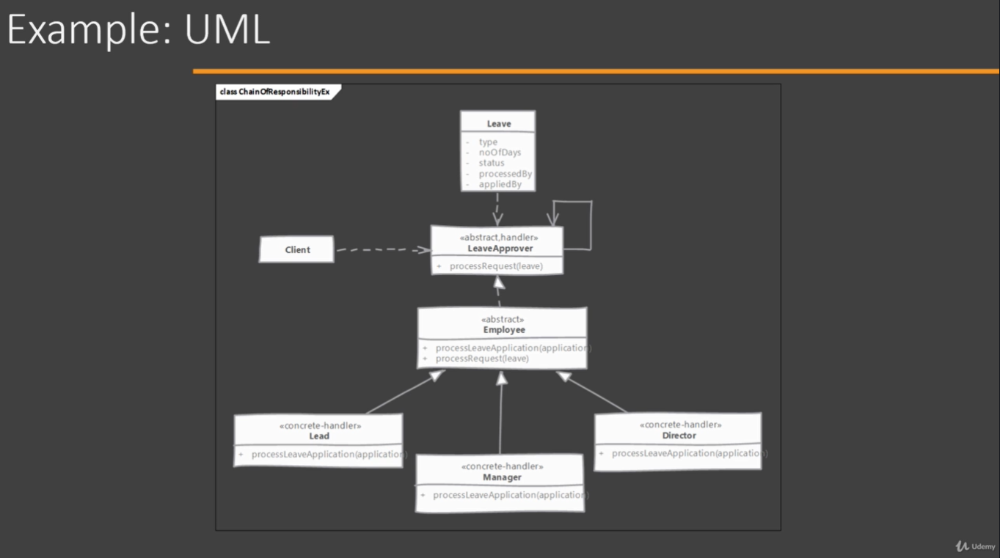

# Chain of Responsibility

## When to use it?

When needing to avoid coupling the code which send request to the code which handles that request.

## How does it solve it?

Typically the code that wants some request to be handled call and exact method on an exact object to process the request. This tight coupling. Chain of responsibility solves this problem by giving more than one object chances to process the request.

Objects are created and chained together knowing which object is next in the chain. First object get a request, if it can not handle it, it simply sends it down the chain.

## Implementing

- Start by defining Handler interface/abstract class
    - Handler must define a method to accept incoming request
    - Handler define method to access the next Successor in the chain. If it is an abstract class then we can even maintain Successor.
- Next, implement Handler in one or more concrete handlers. Concrete Handler should check if it can handle the request. If not it should pass the request to the next Handler.
- Create the chain of objects. It can by done in the Client but typically, this will be done by some framework or initialization code written by the programmer.

## Considerations

### Implementation Considerations

- Prefer defining handler as interface as it allows to implement chain of responsibility without worrying about single inheritance rule of Java.
- Handlers can allow the request to propagate even if the handle the request. Servlet filter chains allow request to flow to next filter even if they perform some action on request.
- Chain can be described using XML or JSON as well so that you can add & remove handlers from the chain without modifying the code.

### Design Considerations

- Existing connections or chain can be use. For example, existing composite pattern can be used to implement this behavior.

## Chain of Responsibility vs Command

#### Chain of Responsibility:

- If Handler can not handle the request it will pass it on to the next handler.
- There is not guarantee that the request will be handled.
- We do not track which handler handled the request and can not reverse the actions of handler.

#### Command:

- With command there is no request been past. Command handles the request it self.
- It is assured that Command will be executed and the request will be handled.
- Commands are trackable. Command instances can be stored in the same order as they execute and they are reversible in nature.

## Pitfalls

- There is no guarantee provided in the pattern that a request will be handled. The request can traverse the whole cain and fall off at the other end without ever being processed and we wont know it.
- It is easy to misconfigure the chain when connecting successors. There is nothing in the pattern that will let us know of such problems. Some handlers may be left unconnected to the chain.
