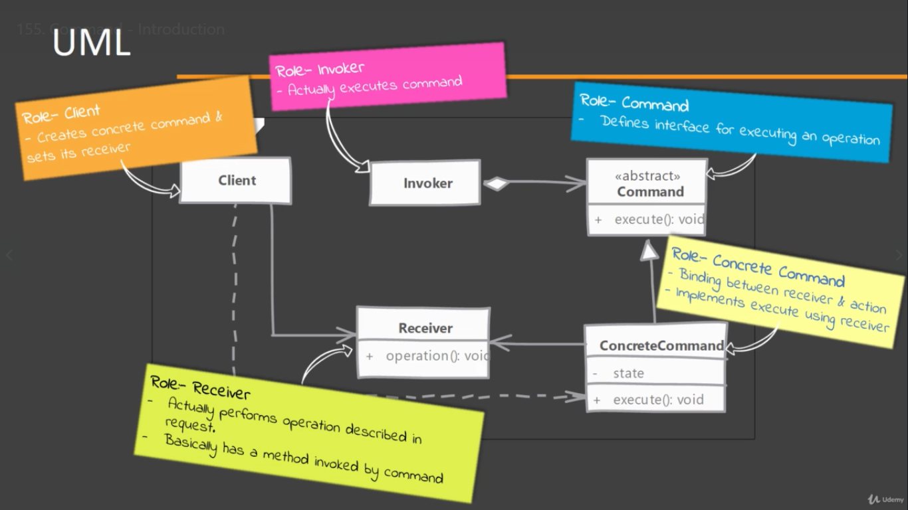
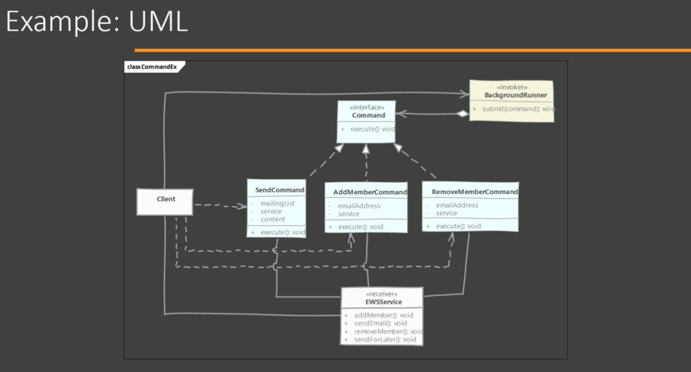

# Command

Used when we want to represent a request or a method call as an object. Information about parameter passed and the actual operation is encapsulated in a object called command.

Advantage of Command pattern is that, what would have been a method call is now an object which can be stored for later execution or sent to other parts of the code.

We can now even queue or command objects and execute them later.

## Implementing

  
- Start by writing command interface that only expose the execute method that does not need any arguments. Who ever is creating this object, is not the one executing it.
    - It must define method which executes the command
- Implement this interface in class for each request or operation type we want to implement.
    - Command should also allow for undo operations if your system needs it.
- Each concrete command know exactly which operation it needs. All it needs is parameters for the operation if required and te Receiver instance o which operation is invoked.
- Client create the Command instance, set up Receiver and all required parameters.
- The command instance is then ready to be sent to other parts of the code. Invoker is the code that actually uses Command Instance and invokes the execute on the command.

## Considerations

### Implementation Considerations

- The 'undo' and 'redo' can be supported in the Commands. This makes them really useful for systems with complex user interaction.
- If your command is simple (i.e. does not have undo feature), doesn't have any state adn simple hides a particular function and its arguments, then you can reuse the same Command object for same type of request.
- For Commands that are going to be queued for long durations, pay attention to the size of the state maintained by them.

### Design Considerations

- Commands can in inherited from other commands to reuse portions of code and build upon the base.
- You can also compose commands with other commands as well. There "macro' commands will have one or more sub-commands executed in sequence to complete a request.
- For implementing undo feature in your command you can make use of Momento design pattern, which allows Command to store the state information of receiver without knowing about internal objects used by receiver.

## Strategy vs Command

#### Strategy:

- Strategy actually contains how the operation is to be carried out.
- Strategy encapsulates an particular algorithm.

#### Command:

- Command contains which operation is to be executed 'by the receiver'.
- Command encapsulates an action.

## Pitfalls

- Things get a bit controversial when it come to returning values & error handling with Command.
- Error handling is *difficult* to implement without coupling the Command with the Client. In cases where client needs to know a return value of execution it's the same situation.
- In code where invoker is running in a different thread, which is very common in situation where Command pattern is useful, error handling and return values get more complicated to handle.