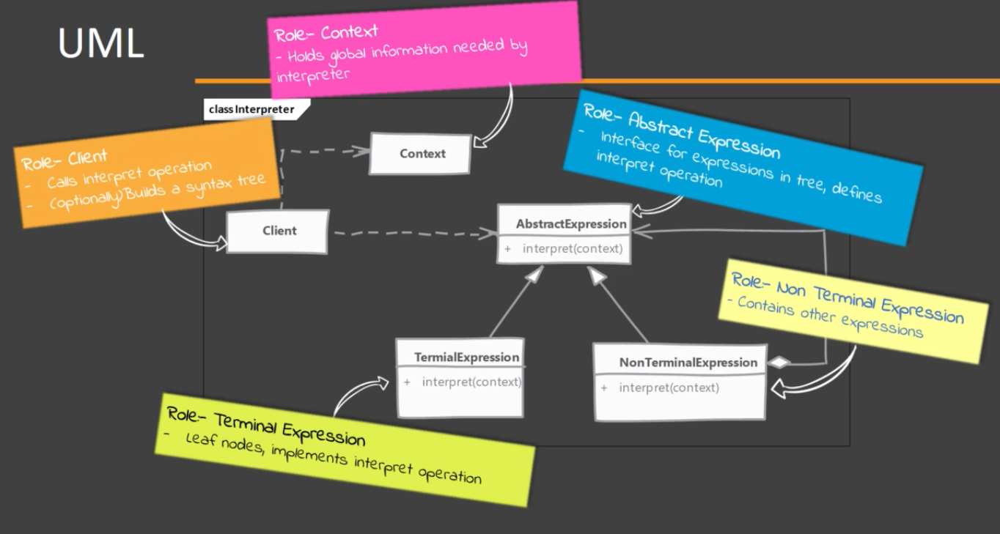
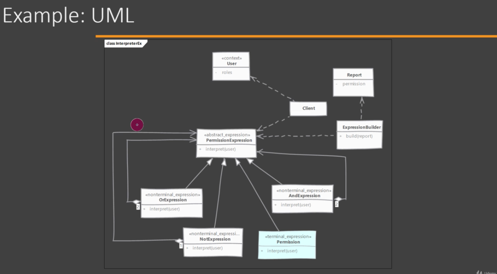

# Interpreter

Use for a very specific problem.

## When to use it?

There is a need to process a simple 'language' with rules or grammar.
    e.g. File access requires user role and admin role.

NOTE: it does not tells how to build the syntax tree / parse the structures.

## How does it solve it?

Interpreter allows to represent the rules of language or grammar in a data structure and then interpret sentences in that language.
Each class in this pattern represents a rule in the language. Classes also provide a method to interpret an expression.

## Implementing

AbstractExpression is an interface that defines all the classes in the pattern and requires an object of context.

Context is an object that hold the global information need by interpreter. Meaning actual statement that we want to interpret or partial reserves of our interpretation.

Client call the interpreter and can optionally build the syntax tree.

  
- Start by studying rules of the language for which the Interpreter will be build.
    - Define an abstract class or interface to represent an expression and define a method in which interprets the expression.
    - Each rule in the class becomes an expression. Expressions which do not need other expressions to interpret become terminal expressions.
    - Then create non-terminal expression classes which contain other expressions. There will in turn call interpret on children as well as perform interpretation of their own if needed.
- Building the abstract syntax tree using classes can be done by the Client it self or we can create a separate class to do it.
- Client will then use the tree to interpret a sentence.
- A context is passes to Interpreter. to store any values which expressions need or modify or populate.

## Considerations

### Implementation Considerations

- Apart form interpreting expressions you can also do other things like pretty printing that use already built interpreter in a new way.
- You still have to do the parsing. This pattern does not talk about how to actually parse the language and build the abstract syntax tree.
- Context object can be used to store and access state of the interpreter.

### Design Considerations

- You can use visitor pattern to interpret instead of adding interpret method in expression classes. benefit of this is that if you are using multiple operations on the abstract syntax tree then visitor allows you to put these operations in a separate class. 
- You can also use flyweight pattern for terminal expressions. You will often find that terminal expressions can be reused.

## Interpreter vs Visitor

#### Interpreter:

- Represents language rules or grammar as object structure.
- Has access to properties it needs for doing interpretation.

#### Visitor:

- Represents operations to be performed on an object structure.
- We need an observable and observe functionality to gain access to the properties.

## Pitfalls

- A class per rule can quickly result in large number of classes, even for moderately complex grammar.
- Not really suitable for languages with complex grammar rules.
- This design pattern is very specific to a particular kind of problem of interpreting language.