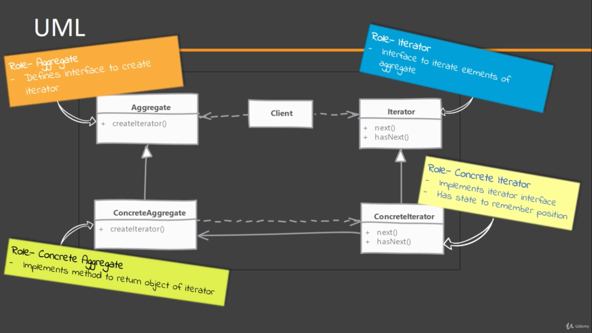
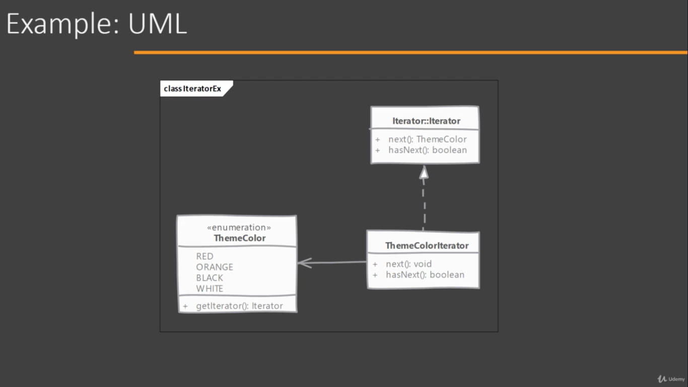

# Iterator

Iterator creates a way to access elements/children of an aggregate object in sequence while hiding the actual internal data structure used.

Iterators are stateful, meaning an iterator object remembers its position while iterating.

NOTE: Iterator can become out of sync if the underlying collection is changed while a code is using Iterator.

## Implementing

  
- Start by defining iterator interface
    - Iterator has methods to check whether there is an element available in sequence (return a boolean) & another method to get that element
- Then implement the Iterator ina class. this is typically an inner class in the concrete aggregate. Making it an inner class makes it easy to access internal data structures.
- Concrete Iterator needs to maintain state to tell its position in the collection of aggregate. if the inner collection changes it can throw an exception to indicate invalid state.

## Considerations

### Implementation Considerations

- Detecting changes to underlying data structure while some code is using an iterator is important notify to the client because then our iterator may not work correctly.
- Having our iterator implementation as inner class makes it easy to access internal collection of aggregate objects.

### Design Considerations

- Always prefer iterator interface so you can change the implementation without affecting client.
- Iterator have many applications where a collection is not directly used but giving sequential access to information is still wanted. (e.g. reading lines from file, from network)

## Pitfalls

- Access to index during iteration is not readily available like we have in a for loop.
- Making modification to the collection while someone is using an iterator often makes that iterator instance invalid as its state may not be valid.