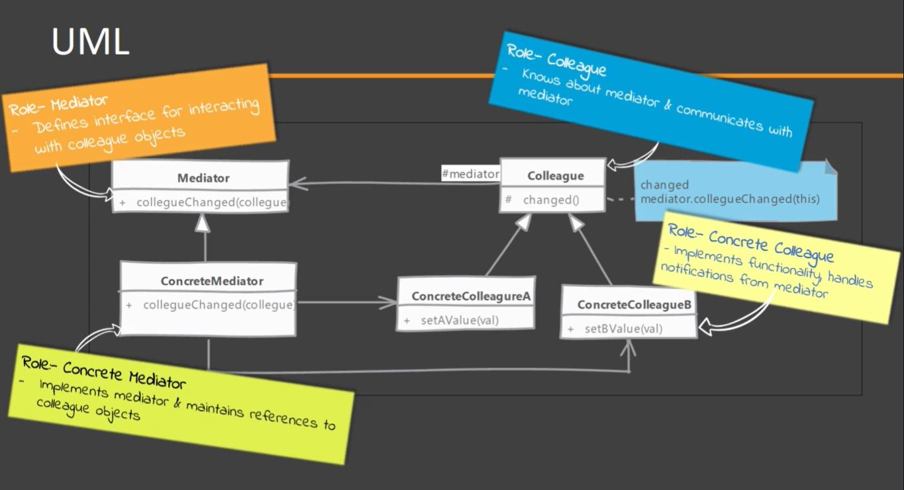
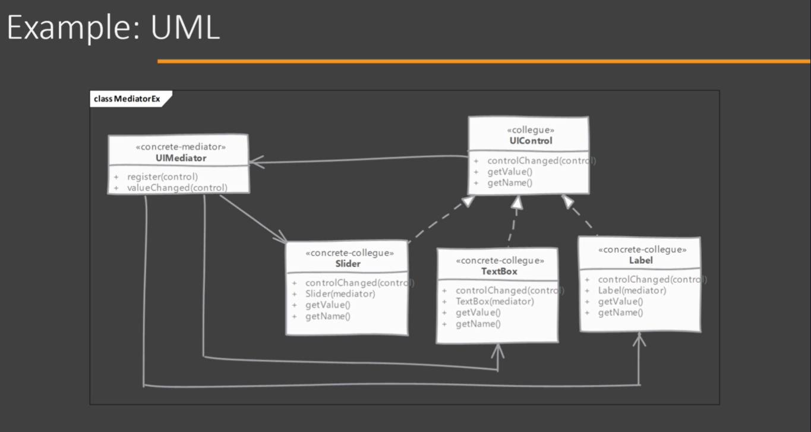

# Mediator

## Which problem it solves?

Helps to remove the complexity in object interaction / collaboration.

e.g. A complex chain of objects that are notify when an object change it's state, and they also notify other objects.

The benefit of this arrangement is that the interaction can now change without needing modifications to participating objects. Changing the mediator allows to add/remove participants in an interaction.

## How does it solve it?

Mediator encapsulates how a set of objects interact with each other in a single object. Due to this encapsulation there isa loose coupling between the interacting objects.

Typically an object explicitly knows about other object to which it wants to interact (i.e. to calla method). In Mediator Pattern, this interaction is within the mediator object & interacting objects only know about the mediator object.

## Implementing

  
- Start by defining mediator
    - Mediators define a generic method which is called by other objects.
    - This methods typically needs to know which object change and optionally the exact property which has changed in that object.
    - We implement this method in which notify rest of the objects about the state change.
- Mediator needs to know about all participants in the collaboration it is mediating. To solve this problem we can either have objects register with mediator or mediator itself can be the creator of these objects.
- Depending upon the particular implementation you may need to handle the infinite change-notify-change loop. This loop can be  he result of the object's value change handler being called for every value change whether is coming from an external source and the Mediator.

## Considerations

### Implementation Considerations

- It's is important that Mediator can identify which object has sent change notification to avoid sending that object the changed value again.
- If an object method took a very long time to process the change it can affect overall performance of mediator severely. In fact this is a common problem in any notification system, so pay attention to synchronization in Mediator methods.
- Its is common to end up with a complex mediator since it becomes a central point which is handling all routing between objects. This can make it a very difficult to maintain as complexity grows.

### Design Considerations

- The mediator can be extended and create variations to be used in different situations like platform dependent interaction.
- Abstract mediator is often not required if the participating objects only work with that one mediator.
- We can use Observer Design Pattern to implement the notification mechanism through which objects notify the Mediator.

## Mediator vs Observer

#### Mediator:

- Its intent is to encapsulate complex interactions between objects. (all objects are notify if there is any change in one object state)
- Mediator implementations are typically specific to objects being mediated.

#### Observer:

- Its intent is to define one-to-may relationship between objects. (objects are listening to the change on a single object, but they do not inform their own state changes)
- Observer pattern implementations are generic. Once implemented it can be used with any classes. Usually implemented with the use of two interfaces "observable" and "observer" and the communication is carry out by using methods defined in those interfaces.

## Pitfalls

- Mediator becomes a central control object. As complexity of interaction grows, mediator complexity can quickly get out of hand.
- Making a reusable mediator, one which can be used with multiple sets of different objects is quite difficult. They are typically very specific to the collaboration. Another competing pattern called Observer is much more reusable.