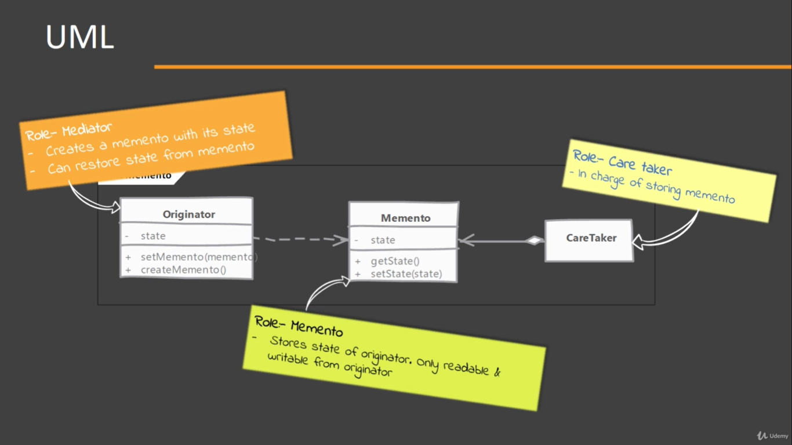
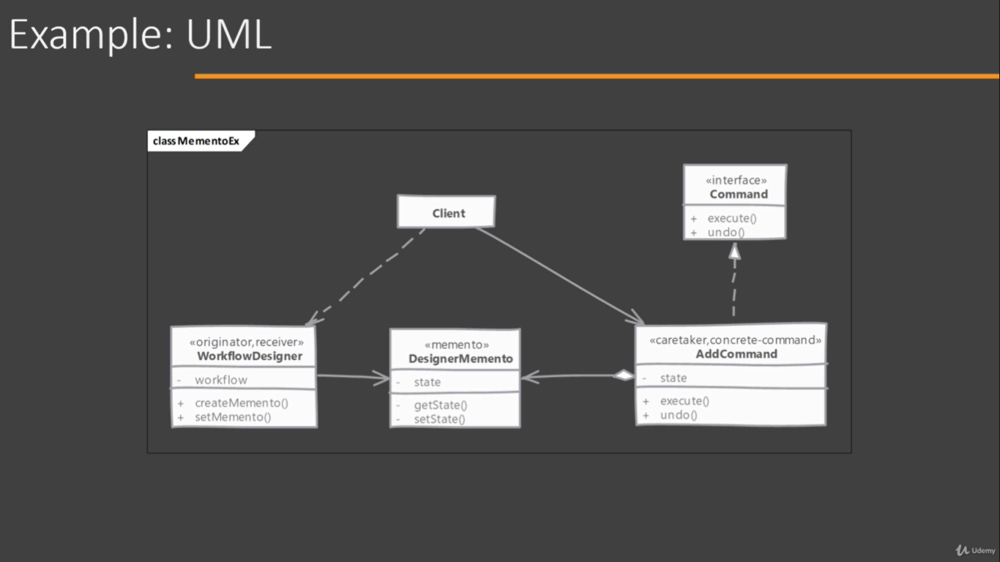

# Memento

## When to use it?

When we want to store an object's state without exposing internal details about the state.

e.g. Save an snapshot of the application state to provide a 'undo' functionality.

The main intent behind saving state is often because we want to restore the object to a previously saved state.

This pattern is often combined with Command Design pattern to provide 'undo' functionality.

## Implementing

  
- Start by finding the Originator;s state which is to be 'stored' in memento.
- Then implement the Memento with requirements that it can not be changed or read outside the Originator. (Memento class should not expose anything store in it)
- Originator provides a methods to get its current snapshot out, which will return an instance of memento.

## Considerations

### Implementation Considerations

- It is important to keep an eye on the size of the states that are stored in memento. A solution might be to discard older state to handle large memory consumption scenarios.
- Memento often ends up being an inner class due to the requirement that it must encapsulate ALL details of what is stored in its instance.
- On resetting to previous state, the effects on other objects/services states should be considered.

### Design Considerations

- If there is a definite, fixed way in which Originator is modify and Mementos created, then we can only store incremental state in mementos. This is especially true if we are using command design pattern where every command stores a memento before execution. Having an incremental state of momentos we can store the change in state from the previous Memento created, thus removing the need to store complete states.
- Mementos can be stored internally by Originator as well but this complicates the originator. An external caretaker with fully encapsulated Memento provides you with more flexibility in implementation.

## Memento vs Command

#### Memento:

- Memento store the object state.
- State of memento is sealed for everyone except Originator
- A Memento needs to be stored for it to be of any use.

#### Command:

- Command encapsulates an operation / action.
- Although commands are typically immutable, their state is often readable.
- Commands can be stores as well but not storing them after execution is optional.

## Pitfalls

- In practice creating s snapshot of state may not be easy if other objects are part of Originator's state.
- Resetting a state may not be as simple as copying references. If the state change of Originator is tied with other parts of the application, then those parts may become out of sync/invalid due to the state resetting.