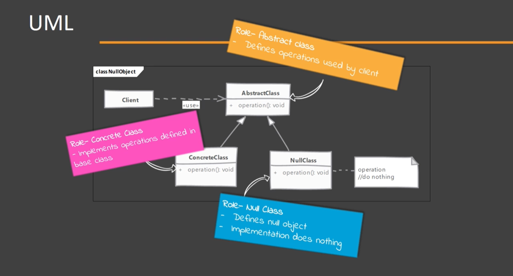
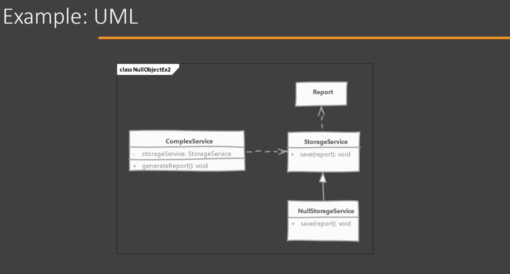

# Null Object

- Normally the 'null' value is used to represent an absence of object. Using Null Object pattern we can provide an alternate representation to indicate an absence of object.

## Which problem it solves?

- This pattern is used when the absence of a collaborator is treated transparently without null checks.

## How does it solve it?

- Most important characteristic of a null object is that it will basically do nothing or store anything when an operation is called on it.

NOTE: Null Object seems like a proxy as it stand in for a real object, however a proxy at some point will use real object or transform to a real object and even in absence of the real object proxy will provide some behavior with side effect. Null Object will not do any such thing. Null object does not transform into a real object.

## Implementing

  
- Start by creating a new class that represents the Null Object by extending from a base class or implementing a given interface.
- In the null object implementation, for each method nothing will be done. However, doing nothing can mean different things in different implementations. E.g. If a method in a null object returns something then we can either return another null object, a predefined default value or null.
- Code which creates objects of our implementation will create and pass our null object in a specific situation.

## Considerations

### Implementation Considerations

- Class which is using Null Objects should not have to do anything special when working with this objects.
- What "do nothing" mean for an operation can be different in different classes. This is especially true when methods in null objects are expected to return values.
- If there is a need where a Null Object has to transform into a real object, then better use something like a State Pattern with a Null Object as one of the states.

### Design Considerations

- Since Null Objects do not have a state and do not have complex behavior they are good candidates for singleton pattern. A single instance of a Null Object can be used everywhere.
- Null Objects are useful in many other design patterns like State to represent a null state or in Strategy Pattern to provide a strategy where no action is taken on input.

## Null Object vs Proxy

#### Null Object:

- Null Objects never transform/create or provide an indirection to real object.
- Null Objects do not 'act on behalf' of the real object. Its job is to do nothing.

#### Proxy:

- Many types of proxies will need a real object eventually.
- In absence of a real object, proxies will provide a matching behavior.

## Pitfalls

- Creating a proper Null Object may not be possible for all classes. Som classes may be expected to cause a change, and absence of that change may cause other class operation to fail.
- Finding what "do nothing" means may not be easy or possible. If the Null Object method is expected to return another object then this problem is more apparent.
