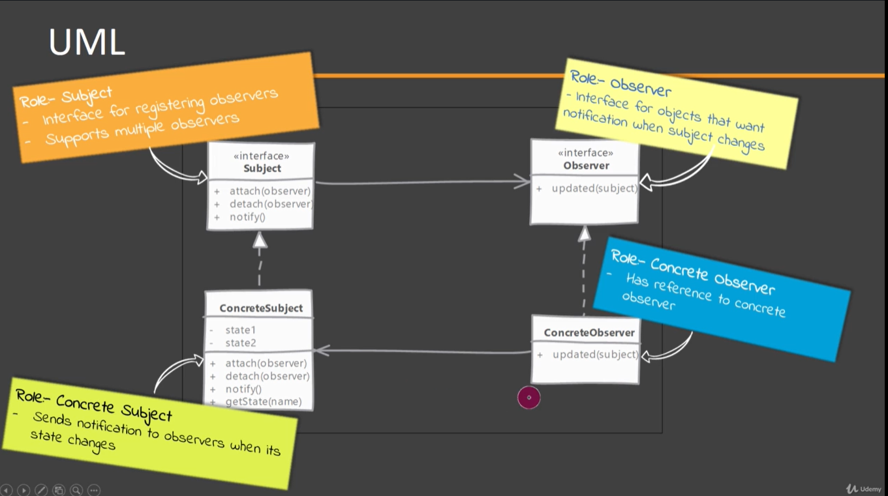
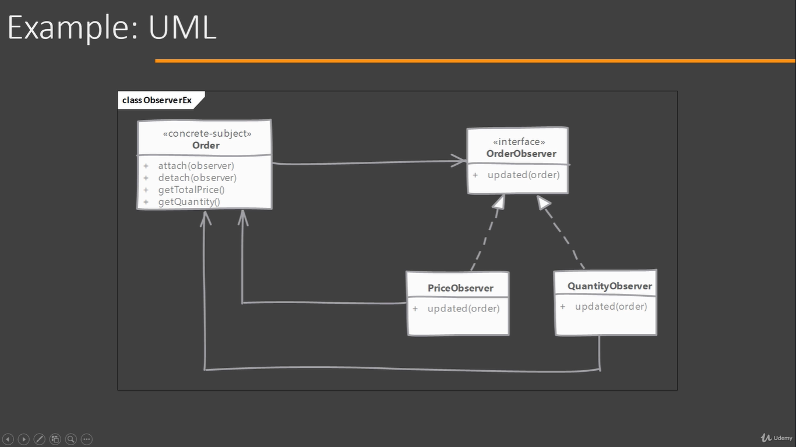

# Observer

This design patterns is also called as publisher-subscriber or pub-sub.

## Which problem it solves?

Using Observer design pattern can notify multiple objects whenever an objects changes state.

## How does it solve it?

By defining one-to-many dependency between objects, where many objects are listening for state changes of a single objects, without tightly coupling all of them together by using interfaces.

It has a objects that is going to publish whenever his state changes and there are multiple observers that are subscribed to this objects and will get a notification when the observer object's state changes.

This pattern is often implemented where Listeners only gets notifications that 'something' has changed. Listeners query back to find out more information if needed. This makes them more generic as different listeners may be interested in different states.

## Implementing

Subject === Observable
  
- Define an interface for observer. Observer is usually a very simple interface and defines a method used by Subject to notify about state changes.
- Subject can be an interface if Observers are expected t listen to multiple objects or else Subject can be any concrete class.
- Implementing subject mean taking care of handling attach, detach of observers, notifying all registered observers and providing methods to provide state information requested by observers.
- Concrete observers use a reference passed to them to call 'Subject' for getting more information about the state. If changes are passed in the notification this is not required.

## Considerations

### Implementation Considerations

- In some rare scenarios you may end with a circular update loop i.e. an update of an observable's state results in notification getting sent to an observer which then take some action and that action results in state change of our observable, restarting the loop.
- An observer object can listen for changes in multiple subjects. It becomes quite easy to identify Originator for the notification if Subjects pass a reference to themselves in notification to Observer.
- Performance can becomes an issue if number of observers are higher and if one or many of them need noticeable time to process notification. This can also cause pile up of pending notifications or missed notifications.

### Design Considerations

- To reduce number of notifications sent on each state update, we can also have observers registered for a specific property or event. This improves performance as on an event, Subject notifies only the interested observers instead of all registered observers.
- Typically notifications are sent by Observable when someone changes its state, but we can also make the client code, which is changing subject's state, send notifications too. This way we get notifications when all state changes are done, However, client code get this additional responsibility which they may forget to carry out.

## Mediator vs Observer

These patterns are complementary, meaning that when solving the communication between objects one of these is going to be chosen.

#### Mediator:

- Mediator have many objects communicating with many other objects.
- Its intent is to encapsulate complex interactions between objects. (all objects are notify if there is any change in one object state)
- Mediator implementations are typically specific to objects being mediated.
- Communication is not simple. All objects participating are notified of change in any one of them.

#### Observer:

- Its intent is to define one-to-may relationship between objects. (objects are listening to the change on a single object, but they do not inform their own state changes)
- Observer pattern implementations are generic. Once implemented it can be used with any classes. Usually implemented with the use of two interfaces "observable" and "observer" and the communication is carry out by using methods defined in those interfaces.
- The communication is simple and can be described as a publish-subscribe.

## Pitfalls

- Every setter methods triggering updates may be too much if client is setting properties one after another on the Observable.
- Also each update becomes expensive as the number of observers increase and we have one or more slow observers in the list.
- If Observers call back the Subject to find what changed then this can add up to an overhead.