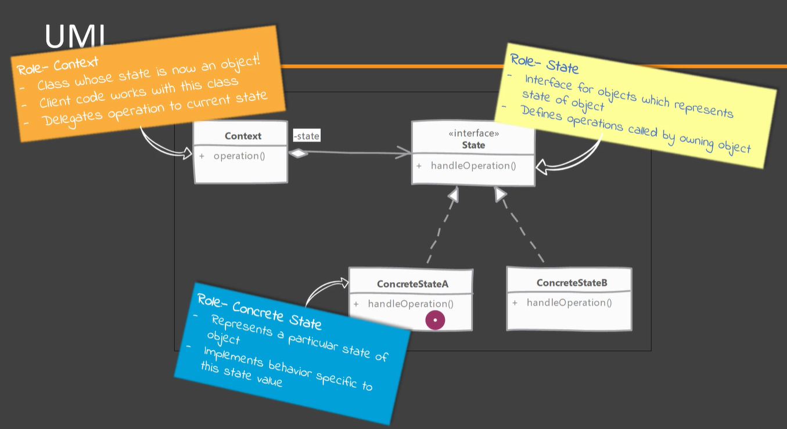
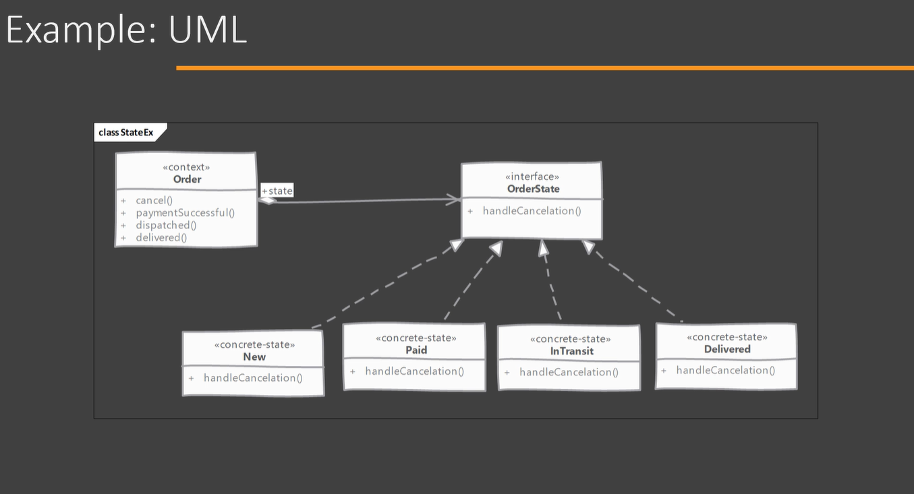

# State

## Which problem it solves?

Allows our objects to behave differently based on its current internal state.

New states and behaviors can be added without changing the main class.

## How does it solve it?

By defining that specific behavior in separate classes.

When ever an operation is called in the main class, it will delegate that operation depending on its current state.

State transitions can be triggered by Sates themselves in which case each State knows about at least one other state's existence. Or the decision to transition to a newer State can be carried out in the main class.

## Implementing

  
- Identify distinct possible values for the state of the object (context). Each state values will be a separate class in the implementation. These classes will provide behavior specific to the state value they represent.
- In the main/context class methods implementations will delegate the operation to the current State object.
- Decide how State transitions are going to happen. States can themselves transition to another State based on input received in a method. Other option is that Context itself can initiate transitions.
- Client interact whit the main class or context and is unaware of existence of state.

## Considerations

### Implementation Considerations

- In some implementations Clients themselves can configure Context with initial state. However after that the state transition is handled either by States or Context
- If state transitions are done by state objects itself then it has to know about tat least one state. This adds to the amount of code change needed when adding new states.

### Design Considerations

- By using flyweight pattern the States which do not have any instance variable and only encapsulates behavior specific to that state.
- State design patter is not the same as a state machine. A state machine, in loose terms, focuses on state transitions based on input values and using some table to map these inputs to states. A state design pattern focuses on providing a behavior specific to a state value of context object.

## State vs Command

#### State:

- Implements actual behavior of an object specific to a particular state.
- A State object represent current state of our context object.

#### Command:

- Command execution simply class a specific operation on Receiver.
- Command represent an operation or request without any direct relation to state of receiver.

## Pitfalls

- A lot more classes are created for providing functionality of context and all those need unit testing.
- States transitions can be tricky to implement. This becomes more complicated if there are multiple possible states to which object can transition form current state. And if State are responsible for triggering transitions then we have a lot more coupling between States.
- We may not realize all possible state we need at the beginning or the design. As the design evolves more classes may need to ve added to handle each particular behavior.
