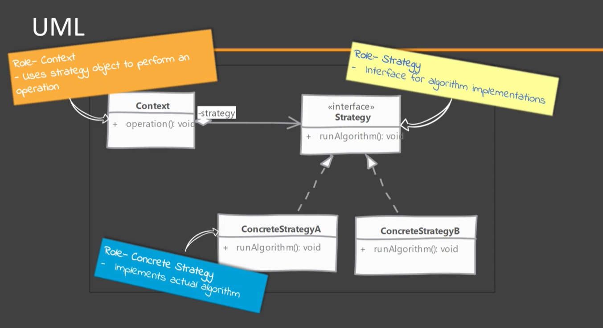
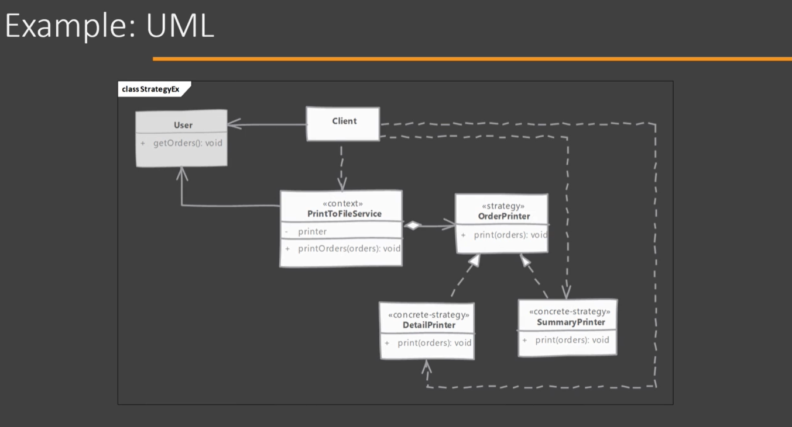

# Strategy

## Which problem it solves?

Allows to encapsulate an algorithm in a class. So the Context or main object can be configure with an object of this class, to change the algorithm used to perform given operations.

## When to use it?

A good indication for applicability of Strategy pattern is if there are different algorithms/behaviors in our methods which are selected with conditional statements like if-else or switch-case.

Really helpful if you there are many possible variations of an algorithm.

## How does it solve it?

Strategy classes are usually implemented in an inheritance hierarchy so that any implementation can be choose and it will work with the main object/context as the interface is the same for all implementations.

## Implementing

- Start by defining the Strategy interface which is used by the main/context class. Context class provides Strategy with all the data that it needs.
- Provide implementations for various algorithms by implementing strategy interface class per algorithm.
- Our context class provides a way to configure it with one of the strategy implementations. Client code will create Context with one of the Strategy object.

## Considerations

### Implementation Considerations

- We can implement our context in a way where strategy object is optional, having a default implementation of an algorithm, if Strategy is not provided it will use it. This makes Context more usable for Client code who do not want to deal with Concrete Strategy objects.
- Strategy objects should be given all data they need as arguments to its methods. If number of arguments it to high, then an interface reference which queries for data can be pass in to Strategy. Context can implement this interface and pass it to Strategy.
- Strategies typically end up being stateless objects, making them perfect candidates for sharing between context objects.

### Design Considerations

- Strategy implementations can make use of inheritance to factor out common parts of the various algorithms into a base class making simpler the implementations of the child algorithms.
- Since strategy objects ofter end up with no state of their own, we can use flyweight pattern to share them between multiple context objects.

## State vs Strategy

#### State:

- Each possible state has a particular class
- If States are responsible for triggering state transitions they have to know about at least the next state.

#### Strategy:

- Each algorithm has a particular class
- Strategy objects do not need to know about each other

## Pitfalls

- Since client code configures Context object with appropriate Strategy objects, Client knows about all implementations of strategy. Creating a tight coupling.
- Introducing a new algorithm means changing client code as well.
