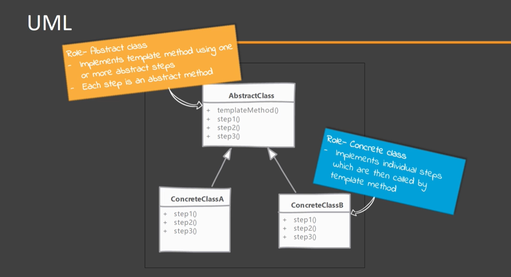
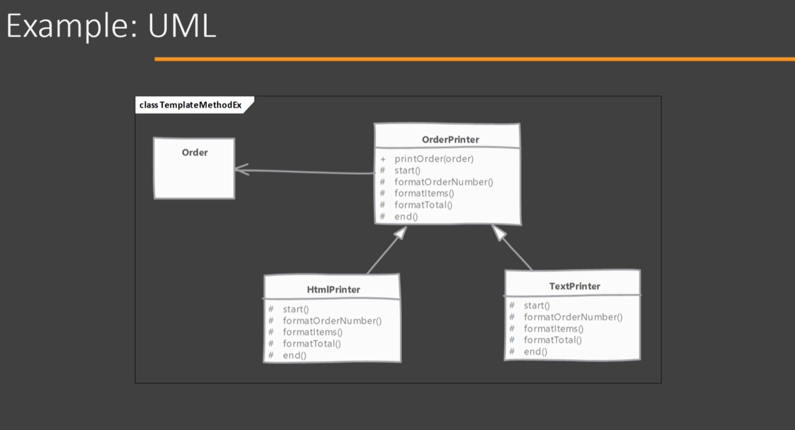

# Template Method

## Which problem it solves?

- This patterns allows you to defer implementation of parts of the algorithm which can vary or change.
- Template methods are an example of “Inversion of Control Principle” (Don’t call us, we’ll call you), referring to the way Template Method calls other methods implemented in subclasses.

## How does it solve it?

- Using Template Method design pattern we define an algorithm in a method as a series of steps (method calls) and provide a chance for subclasses to define or redefine some of these steps.
- The pattern works by defining abstract methods which then have to be implemented by concrete subclasses. These methods are like hooks which are then called by Template Method.

## Implementing

  
- Start by defining the algorithm in Template Method. Try to break the algorithm in multiple steps where each step will become an abstract method.
- Breaking down algorithm in the number of steps should not become too many or it will become tedious to implement all of them in subclasses.
- Next implement the abstract steps In one or more subclasses.

## Considerations

### Implementation Considerations

- A balance must be keeps in how much granular the steps are keep. Too many steps mean too many methods to override in subclasses where each one may be just a primitive operation. Too few would mean that subclasses ended up defining the major ports of the algorithm.
- If needed the Template Method can be made final to prevent subclasses from changing base algorithms.

### Design Considerations

- Use inheritance within subclasses to reuse parts from already implemented steps. This approach allows subclasses to only change steps they need.
- Factory Method design pattern uses Template Method. Actual Factory Method is often classed as part of another Template Method.

## Template Method vs Strategy

#### Template Method:

- All subclasses implement the steps for the exact same algorithm.
- Client code relies solely on inheritance to get a variation of same algorithm.

#### Strategy:

- In strategy design patter each subclass represents a separate algorithms.
- Client code uses composition principal to configure main class with chosen strategy object.

## Pitfalls

- Tacking down what code executed as part of our algorithm requires looking up multiple classes. The problem becomes more apparent if subclasses themselves start using inheritance to reuse only some of the existing steps & customize a few.
