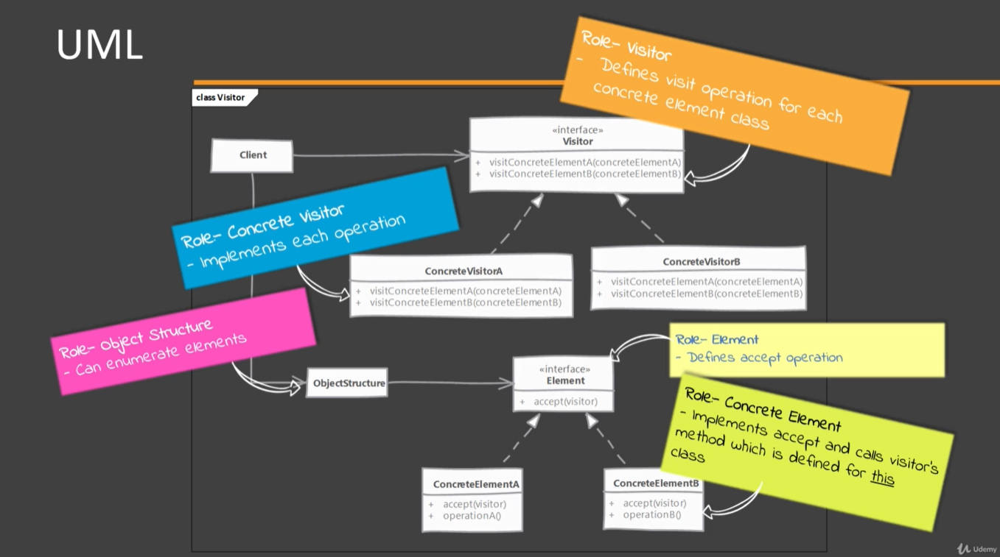
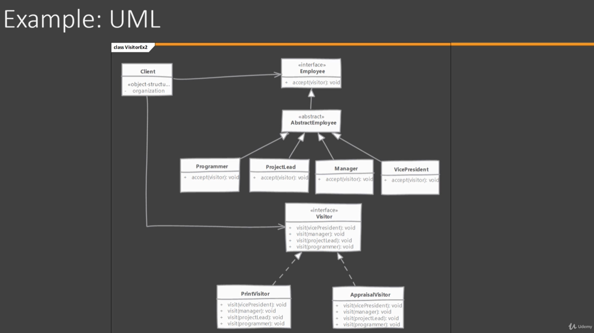

# Visitor

## Which problem it solves?

- Visitor pattern allows to define new operations that can be performed on an object without changing the class definition of the object, adding new functionality to existing objects.

## How does it solve it?

- Think of this pattern as an object that visits all nodes in an object structure. Each time our visitor visits a particular object from the structure, that object calls a specific method on visitor, passing itself as an argument.
- Each time there is a need  for a new operation, a subclass of visitor is created, implement the operation in that class and visit the object structure.
- Objects themselves only implement an "accept" visit where the visitor is pass as an argument. Objects know about the method in visitor created specifically for it and invoke that method inside the accept method.

## Implementing

- Create a Visitor Interface by defining 'visit' methods foreach class we want to support.
- The classes who want functionalities provided by visitor define "accept" method which accepts a visitor. There methods are defined using the visitor interface as parameter type so that we can pass any class implementing the visitor to these methods.
- In the accept methods implementation a method will be call on visitor which is defined specifically for that class.
- Next implement the visitor interface in one or more classes. Each implementation provides a specific functionality for interested classes. If another features is needed, a new implementation of visitor is to be created.

NOTE: the ObjectStructure is not mandatory but an additional feature of this pattern

## Considerations

### Implementation Considerations
- Visitor can work with objects of classes which do not have a common parent/interface. So having a common interface for those classes is optional. However the code which passes our visitor to these objects must be aware of there individual classes.
- Often visitors need access to internal states of objects to carry out their work. So we may have to expose the state using getters/setters.

### Design Considerations
- One effect of this patter is that related functionality is grouped in a single visitor class instead of spread across multiple classes. So adding new functionality is as simple as adding a new visitor class.
- Visitor can also accumulate state. So along with behavior there can also be a state per objects in the Visitor. There is no need to add new state to the objects for the behavior defined in Visitor.
- Visitor can be used to add new functionality to objects structures that were implemented using composite. Or can be used for doing interpretation on the Interpreter design pattern.

## Visitor vs Strategy

#### Visitor:

- All Visitor subclasses provide possible different functionalities from each other.

#### Strategy:

- In Strategy each subclass represent a separate algorithm to solve the same problem.

## Pitfalls

- Often Visitors need access to object's states. So we end up exposing a lot of state through getter methods weakening the encapsulation.
- Supporting a new class in our visitor requires changes to all visitor implementations.
- If the classes themselves change then all visitors have to change as well since they have to work with the changed class.
- A little bit confusing to understand and implement.
