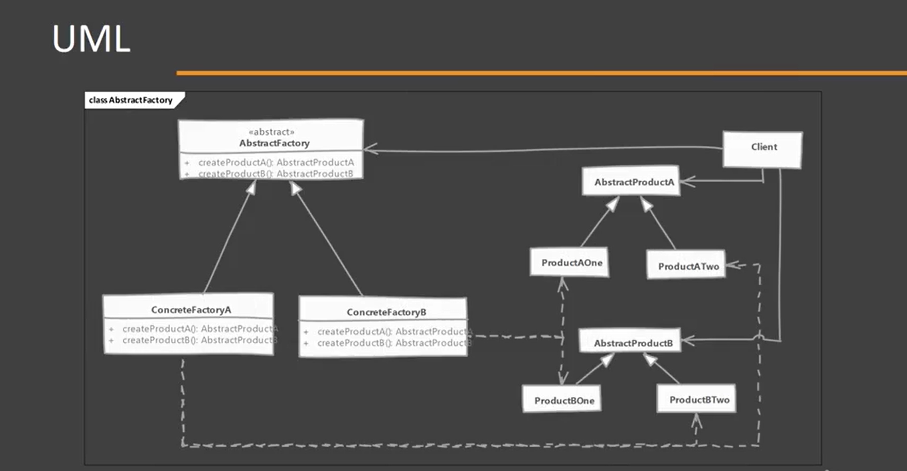
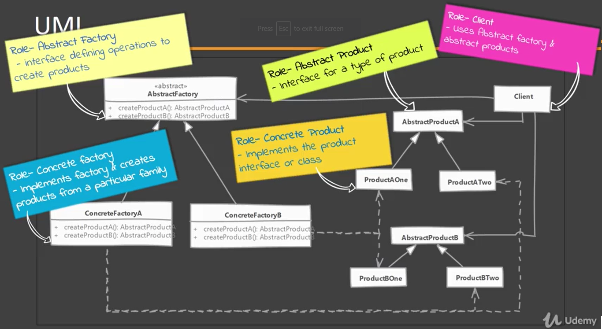
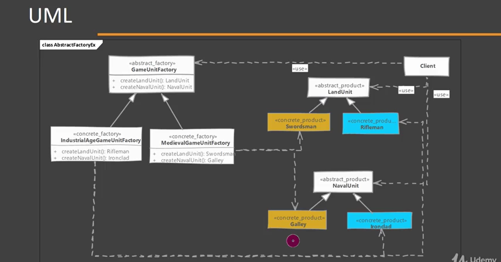

# Abstract Factory

## When to use it?

- It is used when we have to or more objects which work together forming a kt or set and there can be multiple sets or kits that can be created by client code.

## What problem solves?

It separate client code from concrete objects forming such a set and also from the code which create these sets.

## Implementing

Refer to the UML 'abstractFactory-01.png'
1. We start by studying the product "sets"
    1. Create abstract factory as an abstract class or an interface
    2. Abstract factory defines abstract methods for creating products.
    3. Provide concrete implementation of factory for each set of products.
2. Abstract factory makes use of factory method pattern. Think abstract factory as an object with multiple factory methods.

NOTE: typically, classes are compose using the concrete instance of the abstract factory.

## Considerations

### Implementation Considerations
- Factories can be implemented as singletons, we typically ever need only one instance of it anyway. But make sure to familiarize yourself with drawback of singletons.
- Adding new product type requires changes to the base factory as well as all implementations of factory.
- We provide the client code with concrete factory so that is can create objects.

### Design Considerations
- When you want to constrain object creation so that they all work together then abstract factory is good design pattern.
- Abstract factory uses factory method pattern.
- If objects are expensive to create then you can transparently switch factory implementations to use prototypes design pattern to create objects.

## Abstract Factory vs Factory Method

#### Simple Factory:

- Hides factories as well as concrete object used from the client code.
- Suitable when multiple objects are designed to work together & client must use products from single family at a time.

#### Factory Method:

- Hides the concrete objects which are used from the client code.
- Concerned with one product & it's subclasses. Collaboration of product itself with other objects is irrelevant.

## Pitfalls

- A lot more complex to implement than factory method.
- Adding a new product requires changes to base factory as well as ALL implementations of factory.
- Difficult to visualize the need at start of development and usually starts out as a factory method.
- Abstract factory design pattern is very specific to the problem of 'product families'.
