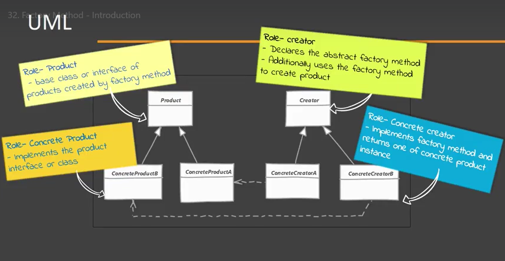

# Factory Method

- Allows us to move the object creating logic from our code to a separate class.
- When we use this pattern we do not need to know which class we are going to instantiate.
- It allows us to add new classes without affecting client code.
- We let subclasses decide which object to instantiate by overriding the factory method.

## Implementing

- Create a class for creator
- Creator can be a concrete class if it can provide a default object in its factory method
-- Else, a subclass can handle the creation. 
-- If it can not provide a default object, then creator will define an abstract factory method and the class will become and abstract.
- Implementation of the creator will override the factory method and return an object

## Considerations

### Implementation Considerations

- The creator can be a concrete class & provide a default implementation for the factory method. In such cases you'll create come "default" object in base creator.
- You can also use the simple factory way of accepting additional arguments to choose between different object types. Subclasses can than override factory method to selectively create different objects from some criteria.

### Design Considerations

- Creator hierarchy in factory method patter reflex the product hierarchy. We typically end up with a concrete creator per object type.
- Template method design pattern often makes use of factory methods
- Another creation design patter called "abstract factory" makes use of factory method pattern

REMEMBER:

The most defining characteristic of factory method pattern is "subclasses providing the actual instance"

Is OFTEN FOUND on existing factory method implementations, that the creator also performs some additional operations using the object that is written by the factory method (not mandatory).

## Pitfalls

- More complex to implement. Meaning the need for more unit testing.
- You have to start with Factory Method design patter from the beginning. it's not easy to refactor existing code into the factory method.
- Sometimes this pattern forces you to subclass just to create appropriate instance.