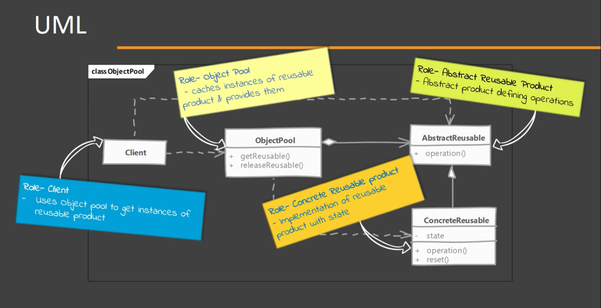
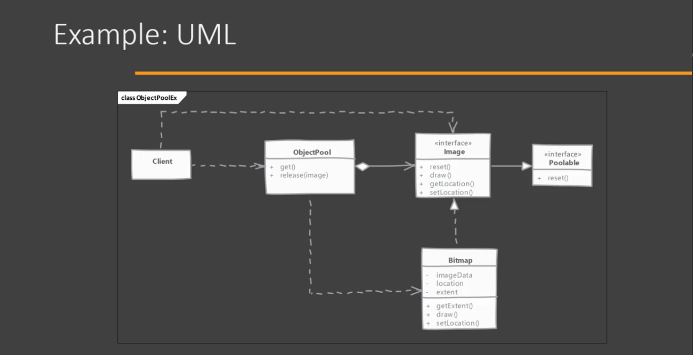

# Object Pool

This pattern can help us to improve performance but its is also one of the most complicated patterns to implement efficiently.

## When to use it?

If the cost of creating an instance of a class is high and we need a large number of objects of this class for shot duration, then we can use an object pool. (cost can be performance or consuming limited external resources, ex. sockets)

It can be done by:
A. Pre-creating objects of the class
B. Collecting unused instances in a in-memory cache. When required we provide an object from this cache

## Implementing

- Create a class for the object pool
    -- A thread-safe caching of objects should be done in pool.
    -- Methods to acquire and release objects should be provided & pool should reset cached object before giving them out.
- The reusable object must provide methods to reset its state upon 'release' by code.
- We have to decide whether to create new pooled objects when pool is empty or to wait until an object becomes available. Choice is influenced by whether the object is tied to a fixed number of external resources.

## Considerations

### Implementation Considerations
- Resetting object state should NOT be costly operation otherwise you may end up losing your performance savings.
- Pre-caching object; meaning creating objects in advance can be helpful as it will not slow down the code using these objects. However it my add-up the start up time and memory consumption.
- Object pool's synchronization should consider the reset time needed & avoid resetting in synchronized context if possible. (move the reset outside of the synchronized context)

### Design Considerations
- Object pool can be parameterized to cache & return multiple objects and the acquire method can provide selection criteria.
- Pooling objects is only beneficial if they involve costly initialization, ex. because of initialization of external resource like a connection or a thread. Do not pool objects JUST to save memory, unless you are running into 'out of memory' errors.
- Do not pool long lived objects or only to save frequent call to new. Pooling may actually negatively impact performance in such cases. Long lived objects are bad candidate to be use in pools.

## Object Pool vs Prototype

#### Singleton Factory:

- We caches objects that frequently live throughout programs entire run.
- Code using objects from object pool has to return the objects explicitly to pool. Depending on implementation, failing to return to pool may lead to memory and/or resource leak.

#### Prototype:

- Prototype create objects when needed and no caching is done.
- Once an object is cloned no special treatment is needed by client code and object can be used like nay regular object.

## Pitfalls

- Successful implementation depends on correct use by the client code. Releasing objects back to pool can be vital for correct working.
- The reusable object needs to take care of resetting its state in efficient way (ex. not take long time), if they don't they are not good candidates for pooling. Some objects may not be suitable for pooling due to this requirements.
- Difficult to use in refactoring legacy code as the client code & reusable objects both need to be aware of object pool.
- You have to decide what happens when the pool is empty and there is a demand for an object. You can either wait for an object to become free or create a new object. Both options have issues. Waiting can have severe negative impact on performance.
- If you create new objects when code ask for an object and none are available then you have to do additional work to maintain or trim the pool size or else you'll end up with very large pool.
