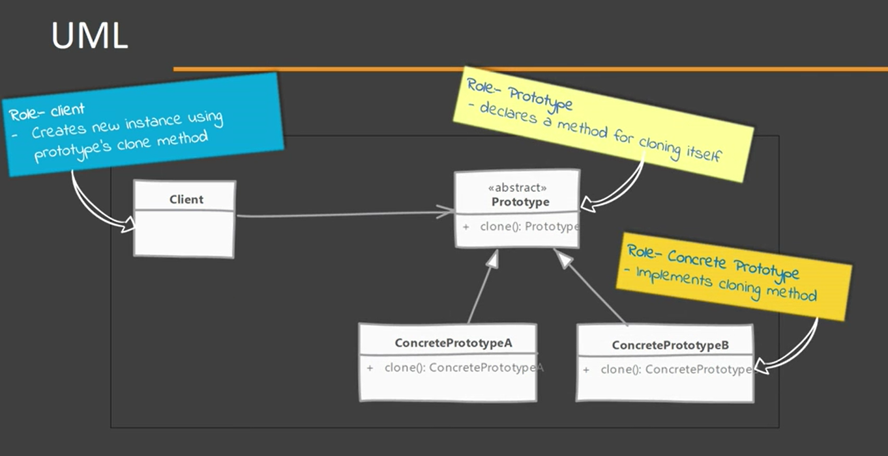
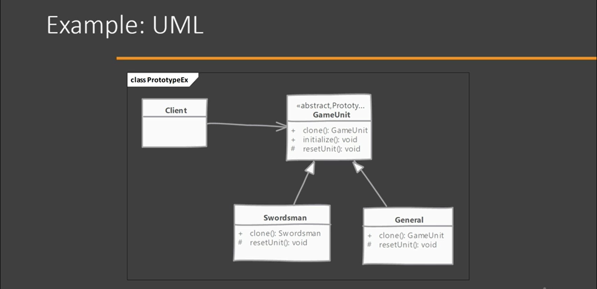

# Factory Method

- Allows us to go around a costly creating of a complex object. To create more instances of such class, we use an existing instance as a our prototype.

## Implementing

- Start by creating a class which will be a prototype
    - The class must implement Cloneable interface (in java is a marker interface)
    - The class should override clone method and return copy itself
    - The method should declare CloneNotSupportedException in throws clause to give subclasses chance to decide on whether to support cloning
- Clone method implementation should consider the deep^ & shallow* copy and choose whichever is applicable

* Simply copy the cloneable properties into the new method
^ In deep copy we create all the objects needed by the prototype object

## Considerations

### Implementation Considerations

- Always pay attention to the deep copy and shallow copy of references. Immutable fields on clones save the trouble of deep copy.
- Make sure to reset the mutable state of object before returning the prototype. It's a good idea to implement this in method to allow subclasses to initialize themselves.
- clone() method is protected in Object class and must be overridden to be public, so it can be accessible.
- Cloneable is a 'marker' interface, and indication that the class supports cloning.

REMEMBER: The clone() method implementation in Object class checks if the class has implemented this interface, and if not, then it throws exception.

### Design Considerations

- Prototypes are useful when you have large objects where majority of state is unchanged between instances and you can easily identify that state.
- A prototype registry is a class where in you can register various prototypes which other code can access to clone out instances. This solves the issue of getting access to initial instance.
- Prototypes are useful when working with Composite and Decorator patterns.

## Prototype vs Singleton

### Prototype:

- We return the copy of an instance, meaning we get different instances.
- Some or even all of the state of instances created with prototypes can be different

### Singleton

- We return same instance every time.
- Since it's the same object that is returned, state is always the same; without mattering from where you access it.

## Pitfalls

- Usability depends upon the number of properties in state that are immutable or can be shallow copied. An object where state is comprised of large number of mutable objects is complicated to clone.
- In java the default clone operation only perform the shallow copy. The need of deep copy requires a custom implementation.
- Subclasses may not be able to support clone and so the code becomes complicated as you have to code for situations where and implementation may not support clone.