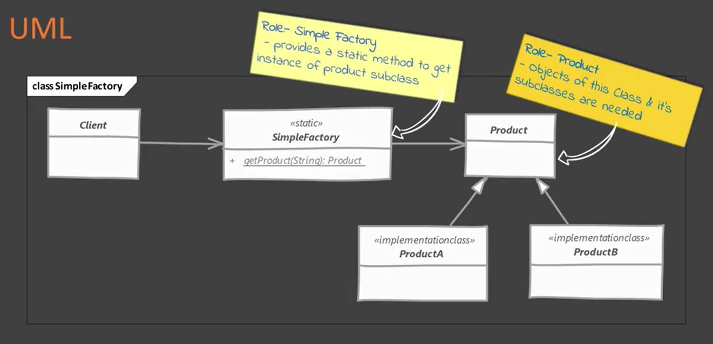

# Simple Factory
Some do not consider simple factory to be a 'design patter', as its simply a method that encapsulates object instantiation.
## When to use it?
It can be use if there is more than one option when instantiating an object and simple logic is used to choose the class type.

## What problem solves?

### 1 - Multiple types can be instantiated and the choice is base on some simple criteria

```java
if (key.equalsIgnoreCase("pudding")) {
    // create pudding object
} else if (key.equalsIgnoreCase("cake")) {
    // create cake object
}
```

Here we simply move the instantiation logic toa separate class. Most commonly to a static method of this class.

## Implementing



- Start by creating a separate class for our simple factory
- Add a method which returns desired object instance
- This method is typically static and will accept some argument to decide which class to instantiate
- Optional: provide additional arguments which will be used to instantiate objects

## Considerations

### Implementation Considerations
- Simple factory can be just a method in a existing class. Adding a separate class however allows other parts of you code to use simple factory more easily.
- Simple factory itself does not need any state tracking so it is best to keep this as a static method.

### Design Considerations
- Simple factory will in turn use other design pattern like builder to construct objects
- In case you want to specialize your simple factory in sub classes, you need a factory method design pattern instead

## Simple Factory vs Factory Method

#### Simple Factory:

- Simply moves the instantiation logic away from client code. Typically in a static method.
- It knows about all classes whose objects it can create
#### Factory Method:

- Is useful when delegating object creating to subclasses
- Is not known in advance about all product subclasses

## Pitfalls

The criteria used by simple factory to decide which object to instantiate can get more convoluted/complex over time. In this case better use a factory method.
