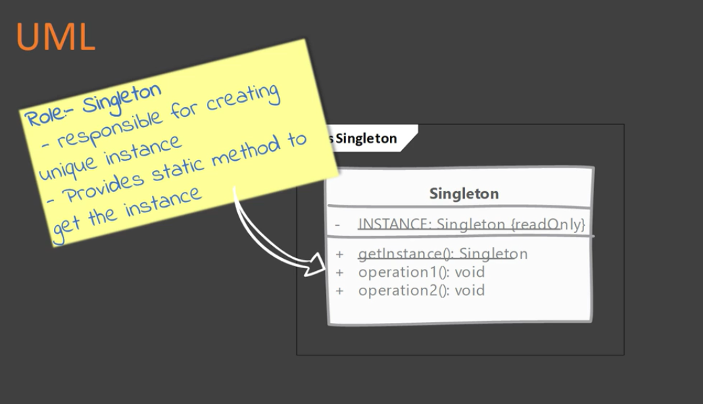

# Singleton

A singleton class has only one instance, accessible globally through a single point (via a method/field). Any state added in the singleton becomes part of the 'global state' of the application.

## When to use it?

When you want to ensure that only a single instance of this class exists

## Implementing

- Control instance creation
    -- Class constructor must not be accessible globally
    -- Subclassing/inheritance must not be allowed
- Keeping track of instance
    -- The class itself is a good place to track the instance
- Give access to the singleton instance
    -- A public static method is approach
    -- It can be expose as a final public static field but it does not work for all singleton implementations 

### Implementation options

There are two ways for implementing a singleton
1. Early initialization - Eager Singleton
    Create the singleton's instance as soon as the class is loaded
2. Lazy initialization - Lazy Singleton
    The singleton's instance is created when required

## Considerations

### Implementation Considerations
- Early/Eager initialization is the simples & preferred way. Always try to use this approach first.
- The 'classic' singleton patter implementation uses double check locking and volatile field.
- The lazy *initialization holder* idiom provides best of both worlds, you do not deal with synchronization issues directly and is easy to implement.
- You can also implement singletons using enums. However due to pre-conceptions about what an enum is, it may be hard sell during code review especially if singleton has mutable fields.

NOTE: if the simple solution works... USE IT!

### Design Considerations
- Singleton creation does not need any parameters. If there is the need of support constructor arguments, a simple factory or factory method pattern is needed instead.
- Make sure that the singleton is *not* carrying to many mutable global states. Having immutable states is also an option.

## Singleton Factory vs Factory Method

#### Singleton Factory:

- Ensure that only one instance of a class is ever created.
- Instance is created without any need of arguments from client code.

#### Factory Method:

- Isolate client code from object creation & delegate object creation to subclasses.
- Factory method allow to parameterize the object creation.

## Pitfalls

- Singleton pattern can deceive you about true dependencies. Since they are globally accessible its easy to miss dependencies.
- They are hard to unit test. You cannot easily mock the instance that is returned.
- Most common way to implement singletons is Java is though static variables and they are held per class loaded and not per JVM. Si they may not be truly Singleton in an OSGi or web application. (ex. having the app instantiated on two different containers). If the app is tight to an external resource that is uniq, a static variable need a copy per class loader, not per JVM.
- If a singleton carries around a large mutable global state you are abusing the Singleton pattern.