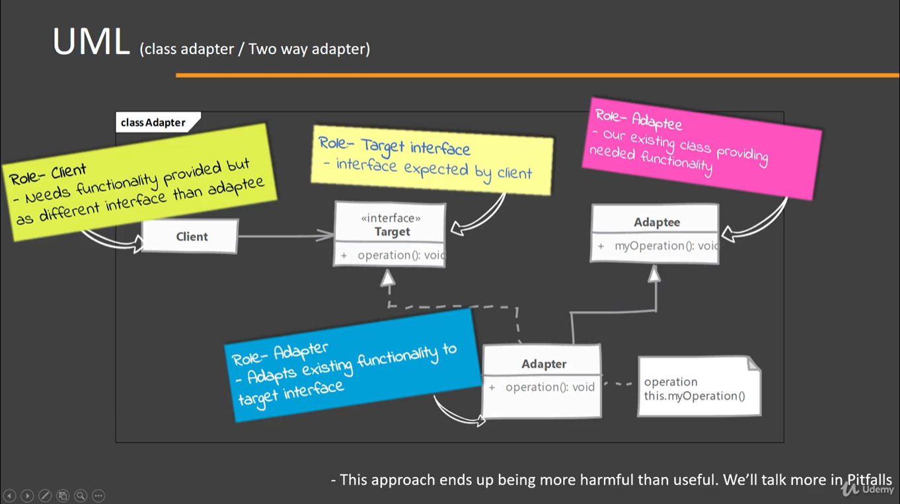
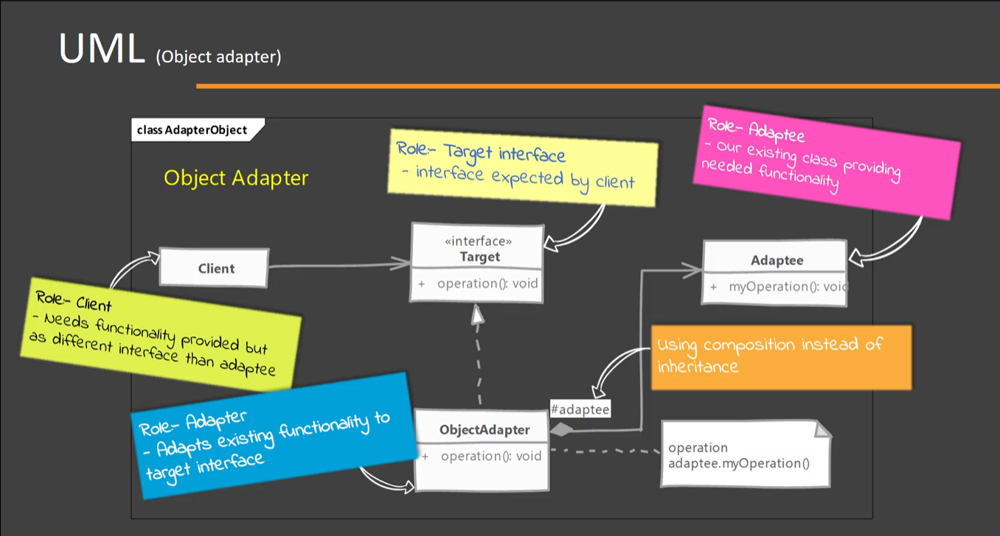

# Adapter - Wrapper

## When to use it?

Wen there is an existing object which provides the functionality that client needs. But client code can not use it because is expecting an object with a different interface. The Adapter design will shape the object to the client's expected interface.

## Implementing

### Implementation options

There are two ways for implementing an Adapter
1. Class Adapter or 'Two way Adapter' (using inheritance)
2. Object Adapter (using composition)

- Create a class for Adapter
    -- Adapter must implement the interface expected by client.
    -- First:
    A. For Class Adapter: Extend the existing class to the Class Adapter
    -- Then:
    A. For Class Adapter: forward the method to another method inherited from Adaptee.
    B. In the object adapter we implement Target interface and accept Adaptee as constructor argument of Adapter (making use of composition).

NOTE: An abject adapter should take adaptee as an argument in constructor* or as a less preferred solution, instantiate it in the constructor thus tightly coupling with a specific adaptee.

The benefit is that Adapter object can be created using a subclass or the Adaptee. In the future we can be the object of subclass. (?)

## Considerations

### Implementation Considerations

- How much work the adapter does depends upon the differences between target interface and object being adapted. If method arguments are same or similar adapter has very less work to do.
- When using class adapter "allows" you to override some of the adaptee's behavior. But this has to be avoided as it leads to have a Adapter that behaves differently than Adaptee.
- Using object adapter allows you to potentially change the Adaptee object to one of its subclasses.

### Design Considerations

- In Java a "class adapter" may not be possible if both target and adaptee are concrete classes. In such case the object adapter is the only solution. also since there is no private inheritance in Java, it's better to stick with object adapter.
- A class adapter is also called 'Two way Adapter' Since it can stand in for both the Target interface and for the adaptee. Meaning we can use object of adapter where either Target interface is expected as well as where an Adaptee object is expected.

## Adapter vs Decorator 

Both uses composition to achieve their functionality.

#### Adapter:

- Objective: Adapt an object to another interface without changing behavior.
- Not easy to use recursive composition (an adapter adapting another adapter) since adapters change interface.

#### Decorator:

- Objective: Enhance object behavior without changing its interface.
- Since decorator do not change the interface we can do recursive composition or in other words, decorate a decorator with ease (since a decorator is indistinguishable form a main object)

## Pitfalls

Adapter does not have many pitfalls, and is a good tool as long and its keep true to its purpose.

- Using target interface and Adaptee class to extend our adapter we can create a "class adapter". However it create an abject which exposes unrelated methods in parts of your code, using a method from Target's interface, another from Adaptee's class. This pollutes the code.
- It is tempting to do a lot of things in adapter besides simple interface translation. But this can result in an adapter showing different behavior than the adapted object.