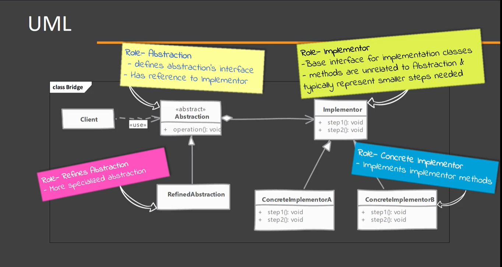
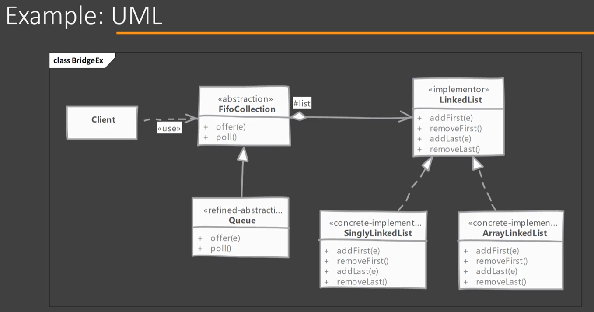

# Bridge

Implementations & abstractions are generally coupled to each other in normal inheritance. Using bridge pattern can decouple them so they can both change without affecting each other.
This is achieve by creating two separate inheritance hierarchies; one for implementation and other for abstraction.

## When to use it?

## Implementing

- Start by defining the abstraction as needed by Client
    -- Determine common base operations and define them in Abstraction.
    -- OPTIONAL: also define a refined abstraction & provide more specialized operations.
    -- Define the Implementor. The Implementor methods do NOT have to match with Abstractor. However, Abstraction can carry out its work by using implementor methods.
    -- Write one or more concrete implementor providing implementation.

## Considerations

### Implementation Considerations

- In case of only having a single implementation, the creation of an abstract implementor can be skipped.
- Abstraction can:
    A. Decide on its own which concrete implementor to use in its constructor.
    B. Delegate that decision to a third class. In the last approach Abstraction remains unaware of concrete implementors & provides greater de-coupling. (preferred way)

### Design Considerations

- Bridge provides great extensibility by allowing us to change abstraction and implementor independently. You can build & package them separately to modularize overall system.
- By using abstract factory pattern to create abstraction object with correct implementation you can de-couple concrete implementors from abstraction.

## Adapter vs Bridge 

#### Adapter:

- Adapter is meant to make unrelated classes work together.
- Adapter finds its usage typically where a legacy system is to be integrated with new code.

#### Bridge:

- Intent is to allow abstraction and implementation to vary independently.
- Bridge has to be designed up front then only we can have varying abstractions & implementations.

## Pitfalls

- It is fairly complex to understand & implement bridge design pattern.
- You need to have a well thought out and fairly comprehensive design in front of you before you can decide to use bridge pattern.
- Needs to be designed up front. Adding bridge to legacy code is difficult. Even for ongoing project adding bridge at later time in development may require a fair amount of rework.