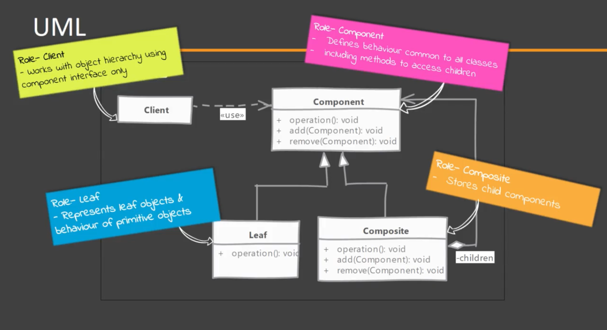

# Composite

A composite pattern implementation will allow you to write algorithms without worrying about whether you are dealing with a leaf node or a composite in hierarchial structures.

## When to use it?

When there is a part-whole relationship or hierarchy (tree whit parents and leafs) of objects and we want to be able to treat all objects in this hierarchy uniformly.
Think of composite pattern when dealing with tree structure of objects.

NOTE: is not a simple composition concept from object oriented programming but a further enhancement to that principal.

## Implementing

This design patters demands to add methods that allow access to children in the base interface. This is a point of controversy because it forces the leaf node to provide implementation when it can not.
But the point of Composite Design is to create Composite or Leaves nodes in a similar way, so you must add this methods to the base interface.

*Leaf* provide the functionality in the method, it has the implementation of the actual operations that are needed by the Client.
*Composite* has children within it. It uses the composition concept and also provides implementation for the operation needed by the client. But in the implementation, this class will delegate them to all their children. Additionally provides methods that allow to add or remove leaf nodes.

### Implementation options

you must choose who will define the children management operation:
- Component
- Composite

What is the main purpose of Composite role in Composite design pattern?
Main role of composite is to delegate operations to its children.

### Process

- Start by creating an abstract class / interface for Component
    -- Component must declare all methods that are applicable to both Leaf and Composite.
    -- We have to choose who defines the children management operations, Component or Composite.
    -- Then implement the Composite. An operation invoked on Composite is propagated to all tis children.
    -- In leaf nodes we have to handle the non-applicable operations like add/remove a child if they are defined in the Component.

## Considerations

### Implementation Considerations

- You can provide a method to access a node's parent. This will simplify traversal of the entire tree.
- YOu can define the collection field to maintain children in base component instead of composite but again that field has no use in leaf class.
- If leaf objects can be repeated in the hierarchy then shared leaf nodes can be used to save memory and initialization cost. But again the number of nodes is major deciding factor as using a cache for small total number of nodes may cost more. (suppose you have a tree structure in the app whit thousand of node and some of them are repeated and are immutable, so they can be cache and be refereed in hundred of places in that structure).

### Design Considerations

- Decision needs to be made about where child management operations are defined. Defining them on Component provides transparency but leaf nodes are forced to implement those methods. Defining them on composite is safer but client need to be made aware of Composite.
- Overall goal of design should be to make client code easier to implement whe using Composite. This is possible if client code can work with Component interface only and does not need to worry about leaf-composite distinction.

## Composite vs Decorator 

#### Composite:

- Deals with tree structure of objects.

#### Decorator:

- Simply contains another (single) object.

## Pitfalls

- Difficult to restrict what is added to hierarchy. If multiple types of leaf nodes are present in system then client code and up doing runtime check to ensure the operation is available on a node.
- Creating the original hierarchy can still be complex implementation specially if you are using caching to reuse nodes and number of nodes are quite high.
