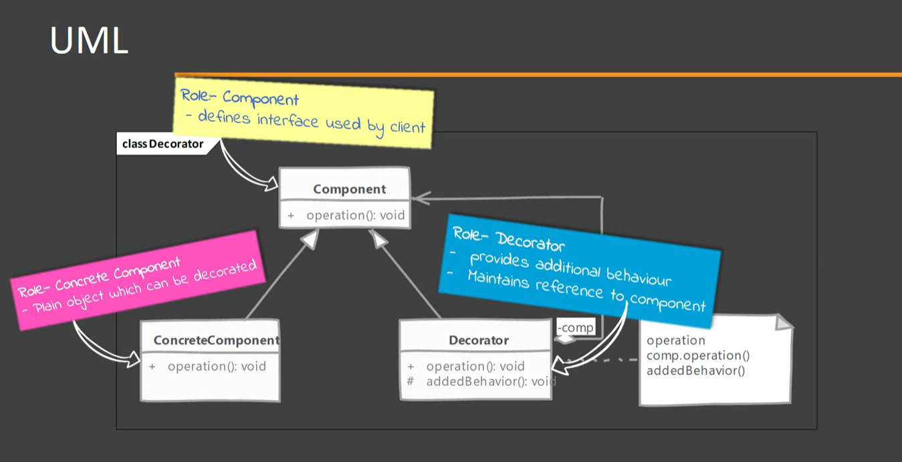
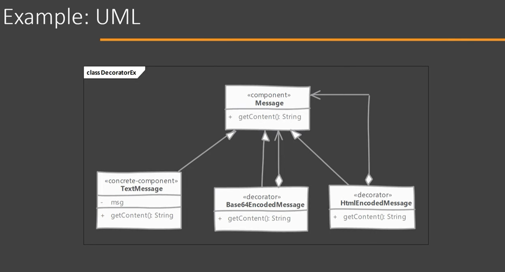

# Decorator

Easy to understand, easy to implement, and provides tremendous functionality.
It wraps an object within itself and provides same interface as the wrapped object. So the client of the original object does not need to change.
A Decorator provides alternative to subclassing for extending functionality of existing classes.

*recursive composition*: a decorator can be composed-with/rap another decorator written for the same object which is turn also wraps another decorator and so on.

## When to use it?

When the behavior of an existing object needs to be enhanced dynamically and/or when required.

## Implementing

- Start with the component:
    - Component defines the interface needed or already used by Client.
    - Concrete component implements the component.
    - We define our decorator. Decorator implements Component and also need reference to Concrete Component.
    - In the Decorator methods we provide additional behavior on top of the one provided by Concrete Component instance.
- Decorator can be an abstract as well and depend on subclasses to provide functionality.

## Considerations

### Implementation Considerations

- Since there are decorators and concrete classes extending from common component, avoid large state in this base class as decorator may not need all that state.
- Pay attention to equals and hashCoded methods of Decorator. When using decorators, you have to decide if decorated objects are equal to the same instance without decorator.
- Decorators support recursive compositions, and so this pattern lends itself to creation of lots of small objects that add "just a little bit" of functionality. Code using this objects becomes difficult to debug.

### Design Considerations

- Decorators are more flexible and powerful than inheritance. Inheritance is static by definition but decorators allow you to dynamically compose behavior using objects at runtime.
- Decorator should act like additional skin over you object. They should add helpful small behaviors to an object's original ones. Do not change meaning of operations.

## Decorator vs Composite 

#### Decorator:

- Decorator's intend is to "add to" existing behavior of existing objects.
- Decorator can be thought as degenerate composite with only one component.

#### Composite:

- Composites are meant for objects aggregation only. Meant to supports multiple child objects withing a single objects.
- Composites support any number of components in aggregation.

## Pitfalls

- Often results in large number of classes being added to system, where each class add small amount of functionality and nested objects
- New comers will start using it as a replacement of inheritance in every scenario. Think of decorators as a thin skin over existing objects.