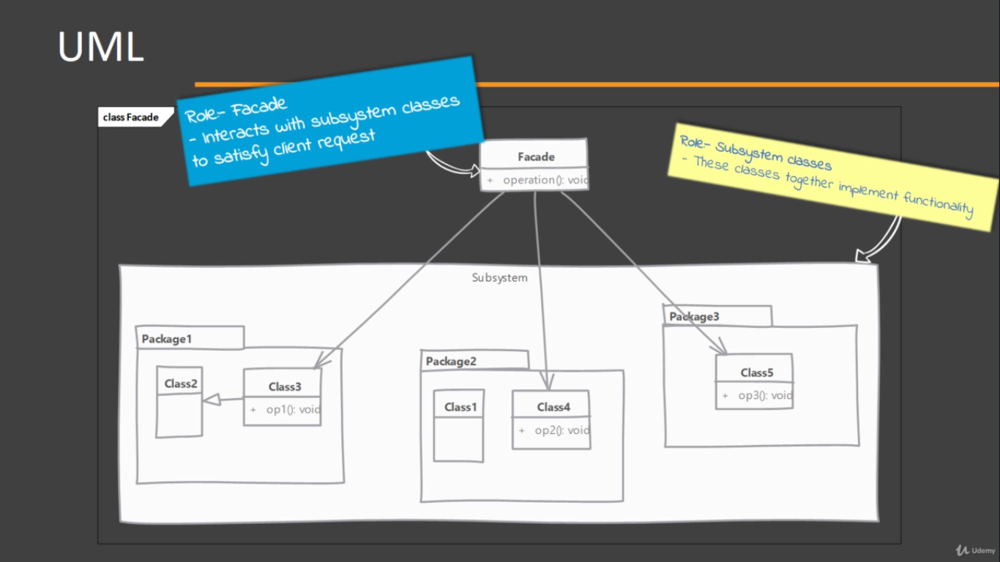
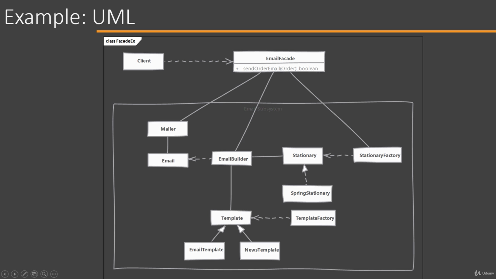

# Facade

Easy to implement and useful when dealing with legacy code.

## When to use it?

When the Client has to interact with a large number of interfaces and classes in a subsystem to get a result.
Facade solves de problem of tightly coupling the Client with the classes and interfaces.

## How does it solve it?

Facade provides a simple and unified interface to a subsystem. The Client will interact with just the facade an gate the same result.

Facade is NOT just a one to one method forwarding to other classes.

## Implementing

- Start by creating a class that will serve as a facade
    - Determine the overall "use cases"/tasks that the subsystem is used for.
    - Write a method that exposes each "use case" or task
    - This methods takes care of working with different classes of subsystem.

## Considerations

### Implementation Considerations

- Facade should minimize the complexity of subsystem and provide usable interface.
- You can have an interface or abstract class as a facade and Client can use different subclasses to talk to different subsystem implementations. (have an email facade interface and two implementations of that facade one for a outlook usage other for a gmail usage)
- A facade is not a replacement for regular usage of classes in subsystem. Those can be still used outside of facade. Your subsystem class implementation should not make assumptions of usage of facade by client code.

### Design Considerations

- Facade is a great solution to simplify dependencies. It allows you to have a weak coupling between subsystems.
- If your only concern is coupling between Client code with subsystem's specific classes and not about the simplification provided by facade, then you can use abstract factory pattern.

## Facade vs Adapter 

#### Facade:

- Intends to simplify the usage by the Client of subsystem's classes and interfaces. Not only a simple class.
- Facade is not restricted by any existing interface. It often defines simple methods which handle complex interactions behind scenes.

#### Adapter:

- Simply adapts an object to a different interface.
- Adapter is written to confirm to a particular interface that the Client expects. It has to implement all the methods from that interface and adapt them using an existing object.

## Pitfalls

Not a pitfall of the pattern but:
- If you need a facade in a NEW design you should probably need to take another look to the API design.
- It is often overused or misused to hide improperly designed APIs. A common misuse is to use them as 'containers of related methods'.