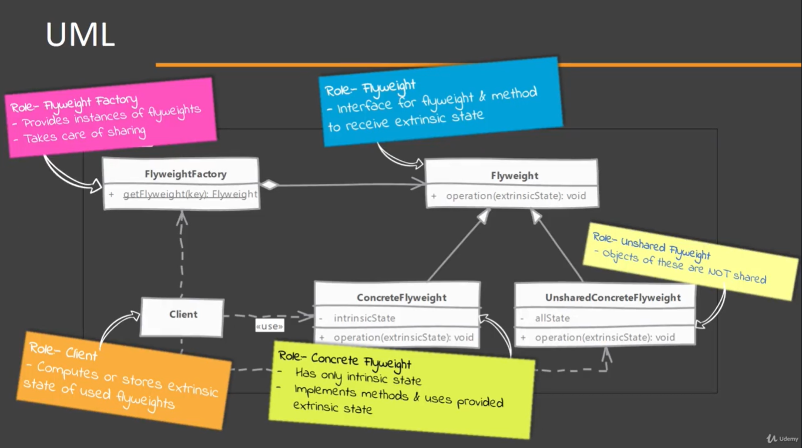
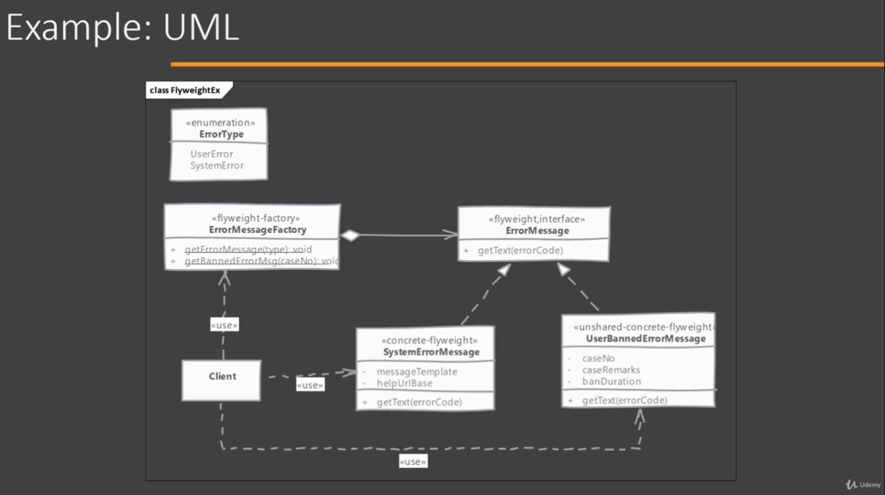

# Flyweight

## When to use it?

When the system needs a large number of objects of a particular class and maintaining these instances is a performance concern.

## How does it solve it?

Flyweight allows to share an object in multiple contexts. But instead of sharing an entire object, which may not be feasible. Dividing the object's state in two parts: intrinsic (sate that is shared in every context) and extrinsic (context specific state). Objects are created with only intrinsic state and shared in multiple context.

A Factory will be provided so the Client can get the required flyweight objects based on some key to identify the flyweight.

The extrinsic state is provided by the Client to carry out its functionality.

## Implementing

ConcreteFlyweight: by not having and extrinsic state is the perfect candidate for sharing.
UnsharedConcreteFlyweight: this would be the typical class if not using flyweight

- Start by identifying the "intrinsic" and "extrinsic" state of the objects.
    - Create an interface for flyweight to provide common methods that accepts extrinsic state
    - Add intrinsic state and methods on the implementation of the Shared Flyweight
    - Ignore extrinsic state arguments on the Unshared flyweight implementation because the full state will be present within.
- Implement the flyweight factory which caches flyweights and also provides methods to get them.

Note: Client can either maintain the extrinsic state of compute it on run time when using flyweight.

## Considerations

### Implementation Considerations

- A factory is necessary to implement the flyweight design pattern for the Client to get the sheared flyweight. Because the number of shared instances can be large, a central place is a good strategy to keep track of all of them.
- Flyweight's intrinsic state should be immutable for successful use of flyweight pattern.

### Design Considerations

- Usability of flyweight is entirely dependent upon presence of sensible extrinsic state in object which can be moved out of object without any issue. (if there is no an extrinsic state than can be moved out of an object, this pattern can not be used for that case)
- Some other designs like State and Strategy can make best use of flyweight pattern.

## Flyweight vs Object Pool 

#### Flyweight:

- State of flyweight object is divided. Client must provide part of the state to it.
- On typical usage client will not change intrinsic state of a Flyweight Instances as it is shared.

#### Object Pool:

- A pooled object contains all of its state encapsulated within itself.
- Client can and will change state of pooled objects.

## Pitfalls

- Runtime cost may be added for maintaining extrinsic state. Client code has to either maintain it or compute it every time it needs to use flyweight.
- It is often difficult to find perfect candidate objects for flyweight. Graphical applications benefit heavily form this pattern however a typical web application may not have a lot of use for this pattern.
