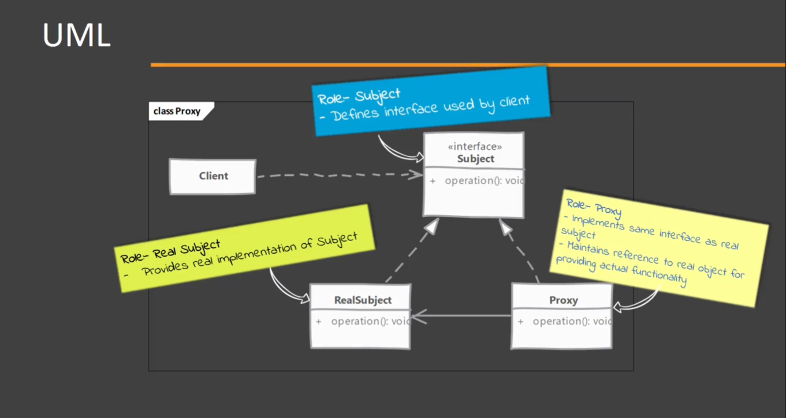
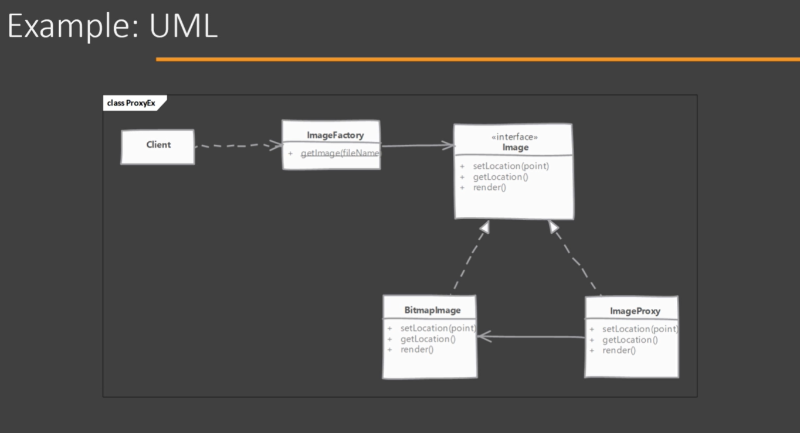

# Proxy

## When to use it?

When its needed to provide a placeholder or surrogate to another object.

## How does it solve it?

Proxy acts on behalf of the object and is used for lots of reasons, some of them:
- Protection Proxy: Control access to original object's operations.
- Remote Proxy: Provides a local representation of a remote object.
- Virtual Proxy: Delays construction of original object until absolutely necessary.

NOTE: Client is unaware of the existence of a Proxy.

## Implementing

NOTE: Not all proxies need to point to a real object.

- Start by implementing proxy
    - Proxy must implement sme interface as the real subject
    - We can either create actual object later when required or ask for one in constructor.
    - In method implementation of proxy we implement proxy's functionality before delegating to real object.
- How to provide client with proxies instance is decided by the application. We can provide a factory or compose client code with proxies instance.

Note: this is called 'static proxies'. Java also provides 'dynamic proxies'

In the example a virtual proxy is implemented.

There will be a standing object for RealObject, and its creation will be postponed us much as possible.
There is an Image interface used by the client, a BitmapImage (Real Object) and a ImageProxy (Proxy) that has a reference to the Real Object

## Considerations

### Implementation Considerations

- How Proxy get hold of the real object depends on what purpose proxy serves. 
    - For 'creation on demand' type of proxies: Actual Object is created only when proxy can't handle client request.
    - Authentication Proxies use pre-built object so they are provided with object during the construction of Proxy.
- Proxy it self can maintain/change some state on behalf of the Real Object in 'creation on demand' cases.
- Performance and synchronization issues are thing to have in mind when using Proxy.

### Design Considerations

- Proxies typically do not need to know about the actual concrete implementation of real objects.
- With Java dynamic proxy allow to create proxies for any object at runtime.
- Proxies are great for implementing security or as a stand-ins for real objects which may be a costly object that you want to defer loading. Proxies also make working with remote services/APIs easy by representing them as regular objects and possibly handling network communications behind the scenes.

## Proxy vs Decorator

#### Proxy:

- Purpose of proxy is to provide features like access control, lazy loading, auditing, etc.
- Depending on the proxy type, it might not need a Real Object.

#### Decorator:

- A decorator is meant to add functionality to existing the already provided functionality by an object, and is used by the Client directly.
- A decorator needs to have a Real Object for it to work.

## Pitfalls

- Java's dynamic proxy only works if a class in implementing one or more interfaces. Proxy is created by implementing these interfaces.
- If there is a need of handling multiple responsibilities like auditing, authentication, as a stand-in for the same instance, it is better to have a single proxy to handle all these requirements.
- Due to the way some proxies create objects on their own, it becomes difficult to manage them.
- Static proxies look quite similar to other patterns like decorator & adapter patterns. It can be confusig to figure it out form code alone for someone not familiar with this pattern.
